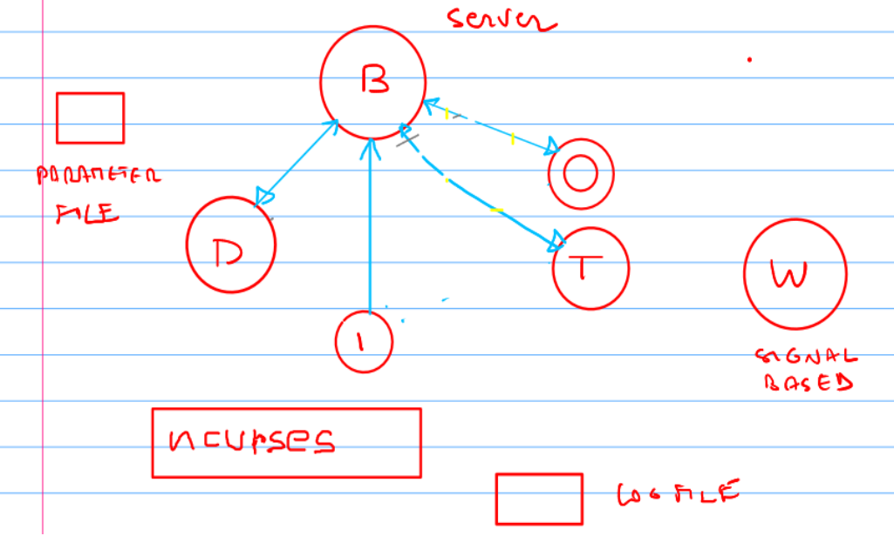

# Drone simulator written in C++

## Table of contents
- [Description](#description)
- [Architecture](#architecture)
  - [Components](#components)
  - [Project structure](#project-structure)
- [How to run](#how-to-run)
- [How to play](#how-to-play)

## Description
This project is a 2D simulation of a drone interacting with its environment. The drone can be controlled by the user through their keyboard. The environment includes obstacles that should be avoided as well as targets that should be approached by the drone.


Legend:
- +: Drone (controlled by player)
- *: Obstacles to be avoided
- Numbers: Targets to be reached

This project was developed as part of the course "Advanced and Robot Programming" .at the University of Genoa (UniGe).

## Architecture
The architecture for this project was strongly dictated by the assignment.



Legend:
- B: Blackboard server
- D: Drone component
- I: Input component
- T: Target component
- O: Obstacle component
- W: Watchdog

### Components
The project includes the following components:

#### Entrypoint
File: `main.cpp`

Entrypoint of the project. Responsible for creating and running the other components. Serves as the master process. Also runs the blackboard server component.

#### Blackboard server
Files: `blackboard.(c|h)pp`

Responsible for rendering the information to the window. Runs a game loop that periodically uses `select` to check, whether any process have new data available.

#### Drone component
Files: `drone.(c|h)pp`

Periodically receives positions of obstacles and targets as well as keyboard input. Updates the drone position accordingly, following a simple physical model and sends the new position back to the blackboard server.

#### Input component
Files: `keyboard.(c|h)pp`

Watches for keyboard input and reports it to the blackboard server.

#### Obstacle component
Files: `obstacles.(c|h)pp`

Manages the obstacles. Periodically checks, whether obstacles have and expired and should be removed or whether new ones should be created. Reports any changes to the blackboard server.

#### Target component
Files: `targets.(c|h)pp`

Manages the targets. Receives detected collision and destroys targets accordingly. Also responsible for creating new targets.

#### Input component
Files: `keyboard.(c|h)pp`

Watches for keyboard input and reports it to the blackboard server.

#### Watchdog
Files: `watchdog.(c|h)pp`

Watches other components by periodically checking shared log file. Terminates program, if one component stops responding.

### Project structure
The project is structured as follows
```
- src/: Contains the source code files for the project.
- include/: Contains the header files for the project.
- build/: The directory where the project will be built. Gets created automatically.
- appsettings.json: The configuration file for the project.
- CMakeLists.txt: The CMake configuration file for building the project.
- build.sh: A script for building the project.
```
Files irellevent for the project are omitted.

## How to run
### Using pre-built binary
- Download latest release binary from GitHub
- make executable
```bash
chmod +x drone-simulator_linux_amd64
```
- copy `appsettings.json` from GitHub
- run binary

### Compiling source
#### Requirements
- `g++` $\geq$ 12.3.0
- `cmake` $\geq$ 3.10

#### Using build script
##### Execution
```bash
./build.sh
```
##### Options:
- `-j {THREADS}`: Number of threads for parallel building. Directly passed to cmake/make. Defaults to 8.
- `-r`: Run the project after build step. Defaults to false.
- `-h`: Show help message.

#### Building manually
```bash
mkdir build
cd build/
cmake ..
make
```

##### Run
```bash
./dronesim
```

#### Debugging
In order to enable debugging symbols, run `cmake` with the corresponding flag.
```bash
cmake -DCMAKE_BUILD_TYPE=Debug ..
```

## How to play
- Move the drone using
  - `E`: Move up
  - `C`: Move down
  - `S`: Move left
  - `F`: Move right
  - `W`, `R`, `X`, `V`: Move diagonally
  - `D`: Stop moving
- Use `Q` to quit the game.
- Avoid obstacles (`*`) and reach targets (`1`, `2`, `3`, ...).
